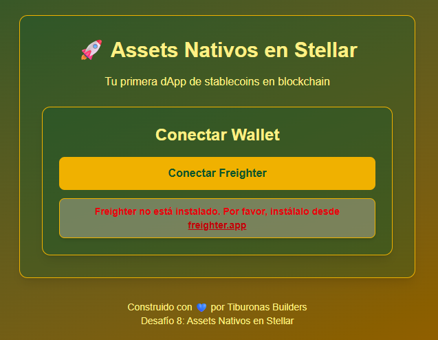
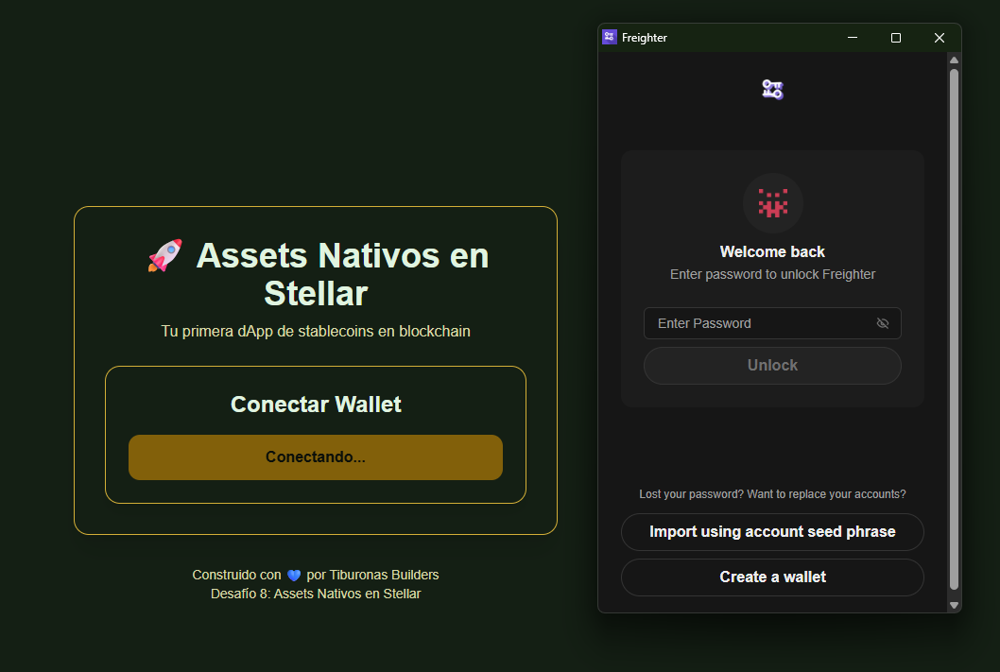
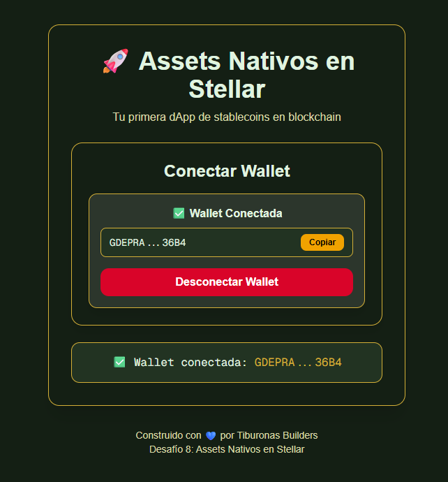
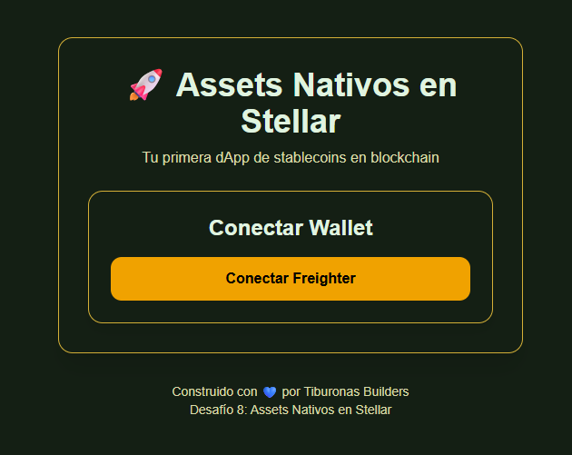

# 📝 TAREA: Conexión Básica con Freighter Wallet

## 🎯 Objetivo
Crear una aplicación Next.js simple que permita **conectar y desconectar la wallet Freighter**, mostrando la dirección pública del usuario.

---

## 🧪 Pruebas que Debes Hacer

### ✅ Prueba 1: Wallet NO instalada
1. Desinstala Freighter temporalmente
2. Click en "Conectar Wallet"
3. ❓ **¿Qué debe pasar?** → Debe mostrar error: "Freighter no está instalado"

### ✅ Prueba 2: Wallet instalada pero bloqueada
1. Instala Freighter pero mantenla bloqueada (con candado)
2. Click en "Conectar Wallet"
3. ❓ **¿Qué debe pasar?** → Freighter te pedirá desbloquear con tu password

### ✅ Prueba 3: Conexión exitosa
1. Desbloquea Freighter
2. Click en "Conectar Wallet"
3. Autoriza la conexión en el popup de Freighter
4. ❓ **¿Qué debe pasar?** → Debe mostrar tu dirección pública (empieza con G...)

### ✅ Prueba 4: Desconexión
1. Estando conectado, click en "Desconectar Wallet"
2. ❓ **¿Qué debe pasar?** → La pantalla vuelve al estado inicial

---

### Despues no se que toque y no lo pude volver a hacer andar y reinicie todo el proyecto otra vez de cero y nunca mas me aparecio el mensaje de freigther no esta instalado cuando apretaba el boton conectar wallet.